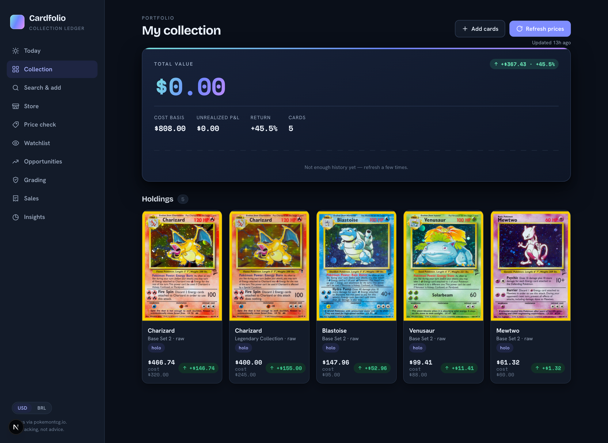
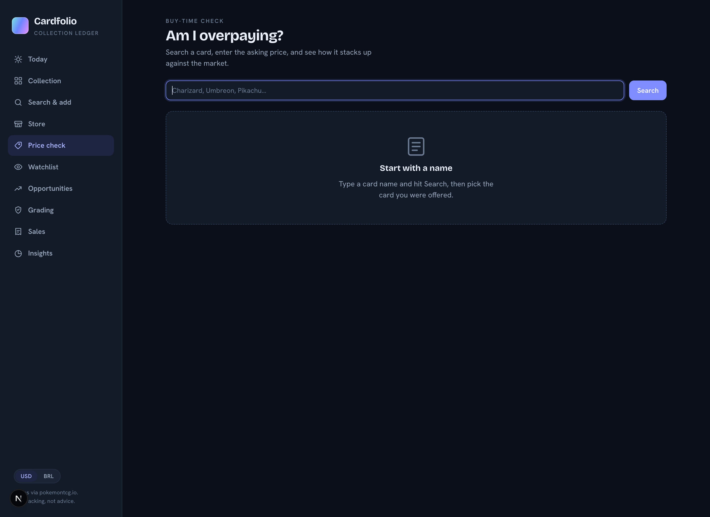
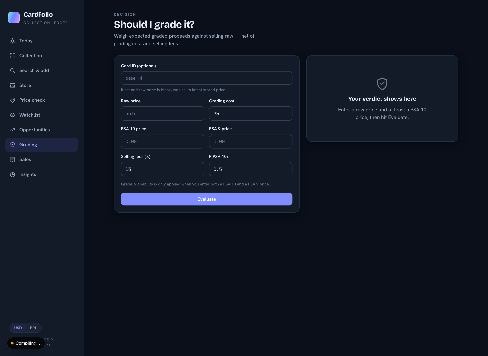
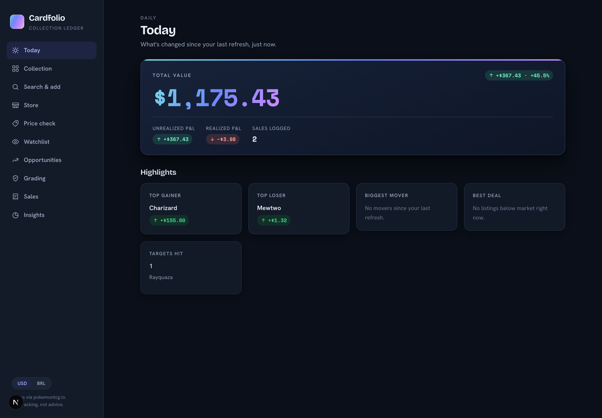
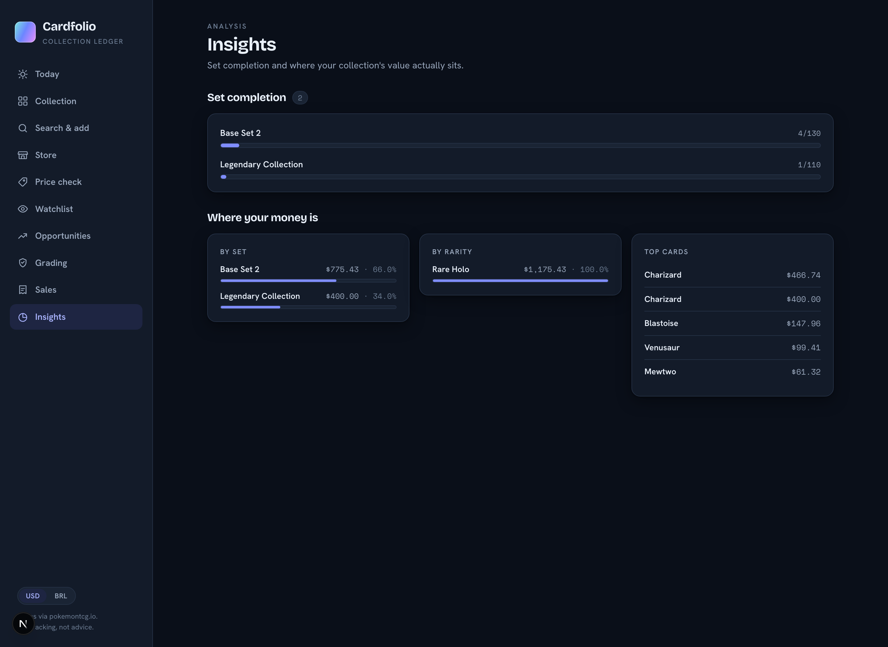
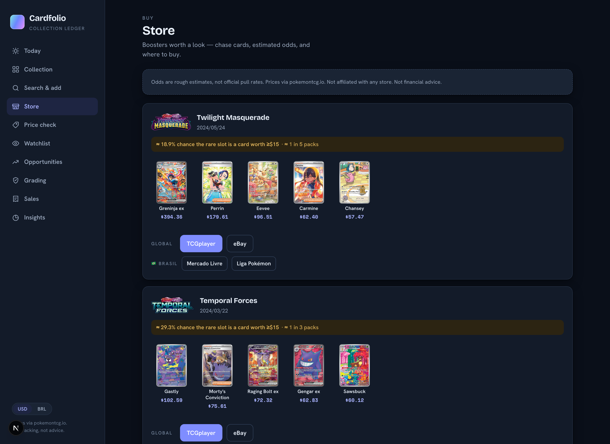
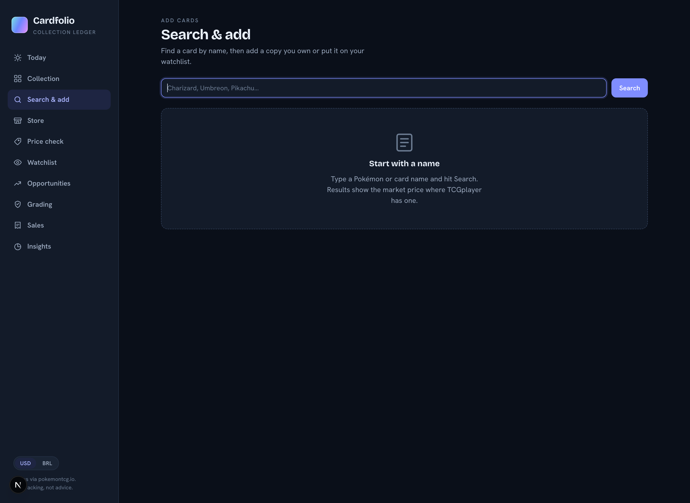
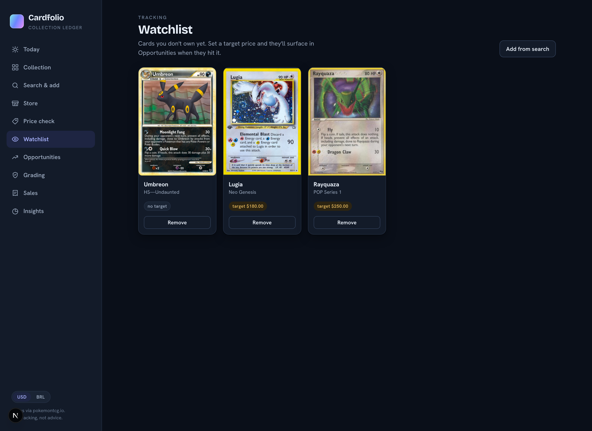
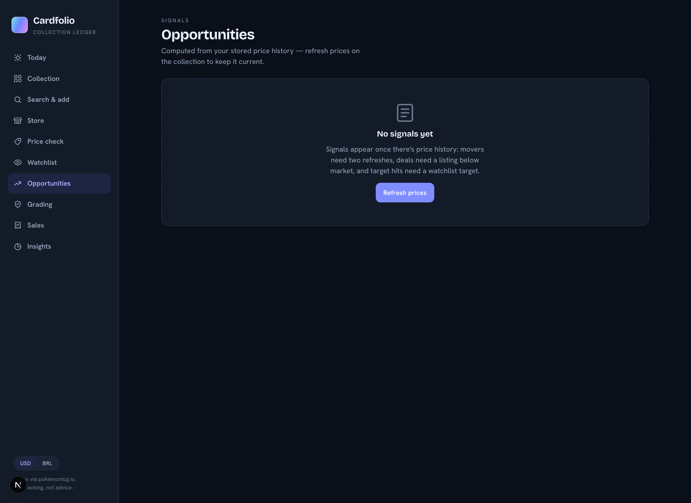
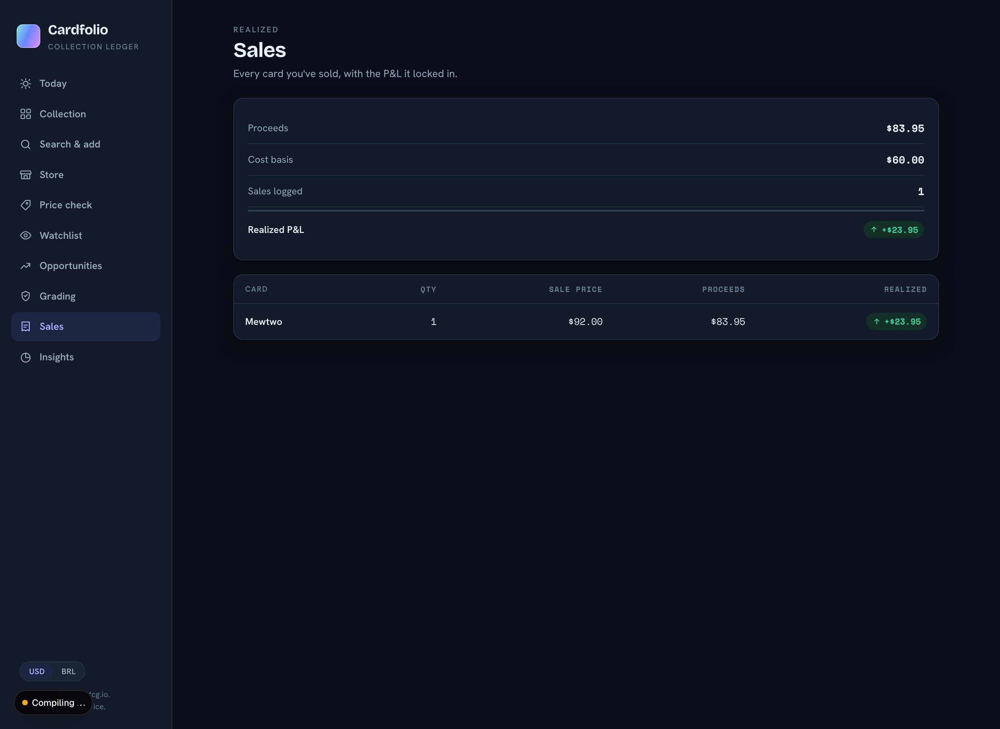

# Cardfolio

A Pokémon card collection tracker that treats your binder like a portfolio — cost basis, unrealized and realized P&L, price history, and a few tools for deciding what to buy, grade, or sell.

Prices come from [pokemontcg.io](https://pokemontcg.io) (TCGplayer market data). Single-user, runs entirely on your machine, no auth.



> **Not financial advice.** This is a personal tracking tool. Card prices are estimates from a third-party API, and the Store page's pack odds are heuristics — not official pull rates. See [Caveats](#caveats).

---

## Contents

- [Quick start (Docker)](#quick-start-docker)
- [Running locally](#running-locally-without-docker)
- [Configuration](#configuration)
- [Features](#features)
- [Screenshots](#screenshots)
- [API](#api)
- [Architecture](#architecture)
- [Tests](#tests)
- [Caveats](#caveats)

---

## Quick start (Docker)

```bash
git clone https://github.com/pedrofurst/pokemon-cardfolio.git
cd pokemon-cardfolio
docker compose up --build
```

Then open **http://localhost:3000**.

The backend comes up on port 8000, Redis on 6380, and your SQLite database lives in a named volume (`cardfolio-data`) so it survives rebuilds.

Optionally add a pokemontcg.io API key first — see [Configuration](#configuration). Put it in `backend/.env`; Compose reads that file if it exists:

```bash
echo "POKEMONTCG_API_KEY=your_key" > backend/.env
docker compose up --build
```

To tear it down (add `-v` to also delete your collection):

```bash
docker compose down
```

> **First boot is slow.** The backend pre-warms the Store page by scanning recent sets against pokemontcg.io. Set `WARM_STORE_ON_STARTUP=false` in `docker-compose.yml` to skip it.

---

## Running locally (without Docker)

You'll need **Python 3.11+** and **Node 20+**. Run the two halves in separate terminals.

### Backend

```bash
cd backend
python -m venv .venv
source .venv/bin/activate          # Windows: .venv\Scripts\activate
pip install -e ".[dev]"

cp .env.example .env               # then edit if you have an API key

uvicorn app.main:app --reload --port 8000
```

The SQLite file (`backend/cardfolio.db`) is created on first run, and schema migrations apply automatically at startup. Interactive API docs are at **http://localhost:8000/docs**.

### Frontend

```bash
cd web
npm install

cp .env.local.example .env.local   # defaults to http://localhost:8000

npm run dev
```

Open **http://localhost:3000**. If the backend isn't running, the app says so explicitly and offers a retry rather than failing silently.

---

## Configuration

### Backend (`backend/.env`)

| Variable | Default | What it does |
| --- | --- | --- |
| `POKEMONTCG_API_KEY` | _(empty)_ | Optional [pokemontcg.io](https://dev.pokemontcg.io/) key. Without one you're on the anonymous rate limit — fine for browsing, but the Store page will throttle. |
| `DATABASE_URL` | `sqlite:///cardfolio.db` | Any SQLAlchemy URL. |
| `ENABLE_SCHEDULER` | `true` | Background job that re-prices your collection on an interval. |
| `REFRESH_INTERVAL_HOURS` | `24` | How often that job runs. |
| `WARM_STORE_ON_STARTUP` | `true` | Pre-build the Store cache on boot. Turning it off makes startup fast and the first Store visit slow. |
| `REDIS_URL` | `redis://localhost:6380/0` | Caches card searches. Optional — if Redis isn't reachable the app logs a warning and runs uncached. Port 6380 because 6379 is often taken. |
| `SEARCH_CACHE_TTL_SECONDS` | `600` | How long a cached search stays fresh. |

### Frontend (`web/.env.local`)

| Variable | Default | What it does |
| --- | --- | --- |
| `NEXT_PUBLIC_API_BASE` | `http://localhost:8000` | Where the browser reaches the backend. Inlined at build time. |

---

## Features

### Collection & P&L

Search pokemontcg.io by name, pick the exact printing, and record what you paid along with condition (Raw / NM / LP / MP / HP / DMG) and variant (Normal / Holofoil / Reverse Holo / 1st Edition). The portfolio slab tracks total value, cost basis, unrealized P&L, return %, and card count. One click re-prices everything you own and everything you're watching. Cards you no longer want to track can be archived rather than deleted: they leave your totals and stop consuming API quota on refreshes, but their price history survives and one click restores them.

### Price history

Every refresh writes a price snapshot per card plus a portfolio-level snapshot. Both render as animated SVG charts — portfolio value over time on the collection page, market price over time on each card's detail page. With fewer than two data points they degrade to an honest "not enough history yet" state instead of faking a line.

### Search caching

pokemontcg.io is slow and inconsistent — the same query has measured anywhere from
1 to 30 seconds, with or without an API key. Card searches are cached in Redis for
10 minutes, which takes a repeat search from seconds to a few milliseconds. Prices
are deliberately **not** cached: they feed the portfolio's numbers, and a stale one
would be written into the price history.

Redis is optional. If it isn't running, the app logs a warning at startup and
serves every search live.

### Opportunity signals

Computed purely from stored snapshots, so the page never blocks on the network:

- **Movers** — cards that shifted ≥10% between the last two snapshots
- **Deals** — cards where TCGplayer's `directLow` sits ≥15% under market
- **Target hits** — watchlist cards that fell to or below your target price

Both thresholds are query params, so you can tune them.

### Price check — "am I overpaying?"

Pick a card, type the asking price, and get a verdict (`great deal` → `overpriced`) with an animated gauge that moves a marker from the market position to your offer, plus a ledger of offer / market / low / direct low / delta.



### Grading ROI

Weighs expected graded proceeds against just selling the card raw. Nets out grading cost and selling fees; when you supply both PSA 10 and PSA 9 prices it weights them by your P(PSA 10), and when you supply only one it says so rather than quietly assuming a guaranteed outcome. Returns a `GRADE` / `DON'T GRADE` verdict, ROI %, and an itemized breakdown.



### Sales & realized P&L

Log a sale from a card's page (quantity, price, fee). The holding shrinks or disappears and the sale row is written in a single transaction. The Sales page keeps a realized-P&L ledger with per-sale proceeds.

### Today digest

One screen for "what changed": total value, unrealized and realized P&L, sales count, and highlight cards for top gainer, top loser, biggest mover, best deal, and targets hit.



### Insights

Set-completion progress (distinct cards owned vs. the set's printed total) and allocation breakdowns showing where your money actually sits — by set, by rarity, and top cards by value.



### Store / booster guide

Scans recently released sets and, for each, surfaces the top chase cards by market price alongside an estimated hit rate expressed as "≈ 1 in N packs". Buy links are plain marketplace searches — no affiliate codes — split into Global (TCGplayer, eBay) and 🇧🇷 Brasil (Mercado Livre, Liga Pokémon). Results cache for 6 hours on disk so a restart doesn't force a cold rebuild.



### 3D holographic viewer

Card detail pages have a "View in 3D" mode: a real WebGL card built with three.js, with a custom GLSL shader producing a fresnel-driven rainbow sheen over the art. Drag to rotate with inertia. Falls back to a flat image when WebGL isn't available.

### Currency toggle

Global USD/BRL switch backed by a live exchange rate (cached server-side for an hour) and persisted to `localStorage`.

### Details worth mentioning

- Every animation checks `prefers-reduced-motion`
- Toasts are `aria-live`; loading states are real skeletons
- No CSS framework and no chart library — hand-written CSS and hand-rolled SVG charts
- Per-card failures during a price refresh are isolated, so one bad card doesn't sink the batch

---

## Screenshots

| | |
| --- | --- |
|  **Collection** |  **Search & add** |
|  **Watchlist** |  **Opportunities** |
|  **Sales ledger** |  **Insights** |

---

## API

Full interactive docs at `/docs` when the backend is running.

| Method | Path | Description |
| --- | --- | --- |
| `GET` | `/health` | Liveness check |
| `GET` | `/cards/search?q=` | Search cards by name |
| `POST` | `/holdings` | Add a card you own |
| `GET` | `/holdings` | Collection + portfolio summary; optional `archived` query param |
| `POST` | `/holdings/{id}/sell` | Log a sale |
| `PATCH` | `/holdings/{id}/archive` | Archive a holding, keeping its price history |
| `PATCH` | `/holdings/{id}/restore` | Restore an archived holding |
| `GET` | `/sales` | Realized P&L + sale history |
| `POST` | `/prices/refresh` | Re-price held and watched cards |
| `GET` | `/prices/status` | Last refresh timestamp |
| `GET` | `/history/portfolio` | Portfolio value time series |
| `GET` | `/history/card/{id}` | Per-card price time series |
| `POST` | `/watchlist` | Watch a card, with optional target |
| `GET` | `/watchlist` | List watched cards |
| `DELETE` | `/watchlist/{id}` | Stop watching |
| `GET` | `/opportunities` | Movers, deals, target hits |
| `POST` | `/price-check` | Verdict on an asking price |
| `POST` | `/grading/evaluate` | Grading ROI analysis |
| `GET` | `/digest` | Today summary |
| `GET` | `/insights` | Set completion + allocation |
| `GET` | `/fx` | USD→BRL rate |
| `GET` | `/store` | Booster guide |

---

## Architecture

```
backend/app/
  routers/       HTTP layer — request/response only
  services/      business logic
  providers/     external HTTP, behind Protocols
  repositories/  database access
  cache.py       Redis-backed cache, falls back to a no-op
  models.py      SQLModel tables
  scheduler.py   APScheduler price refresh

web/src/
  app/           Next.js App Router pages
  components/    UI primitives (charts, 3D viewer, toasts, currency)
  lib/           API client
```

Two rules hold the backend together: external HTTP only happens inside `providers/`, and database access only happens inside `repositories/`. Providers sit behind Protocols, which is why the graded-price seam exists without a graded-price vendor wired up.

Migrations aren't Alembic — `run_migrations()` is an idempotent column-adder that runs at startup, which is proportionate for a single-user SQLite app.

Every user-owned row carries an `owner_id`, currently hardcoded to `"me"`. Single-user today, but shaped so multi-user wouldn't require a rewrite.

**Stack:** FastAPI · SQLModel · Redis · APScheduler · httpx · Next.js 16 (App Router) · React 19 · three.js · TypeScript

---

## Tests

224 backend tests, covering services, repositories, routers, migrations, and the scheduler. External HTTP is stubbed with `respx`.

```bash
cd backend
source .venv/bin/activate
pytest
```

There is no frontend test suite.

---

## Caveats

Being upfront about where this is approximate:

1. **Store pack odds are heuristics, not pull rates.** The estimate is the share of above-Uncommon cards in a set worth ≥$15 — a proxy for "how often does a pack contain something good", not a real rare-slot distribution. Don't make purchasing decisions on it.
2. **Graded prices are typed in by hand.** No graded-price API is integrated. The `GradedPriceProvider` Protocol is a seam for a future PriceCharting-style source; today the null implementation is what ships.
3. **Prices are third-party estimates.** They come from TCGplayer via pokemontcg.io and lag the real market.
4. **The currency toggle isn't fully wired everywhere.** Watchlist targets, opportunity prices, grading results, and price-check figures still render in USD regardless of the toggle.
5. **No auth.** Anyone who can reach the port can read and write your collection. Keep it on localhost.

---

## License

MIT
